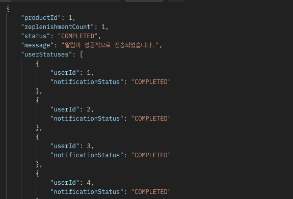

## hanghae-99 
 
## 1. 프로젝트 개요

---

* 상품이 재입고 되었을 때, 재입고 알림을 설정한 유저들에게 재입고 알림을 보내줍니다.

---

## 2. 기술 스택 

* 언어 : Java17
* 프레임워크 : Spring Boot 8.x
* 데이터베이스 : MySQL 8.036
* 도구 : Docker , Docker-Compose
* 빌드 : Gradle 

---

## 3. 주요기능

1. 상품 재입고 알림 기능 
    : 사용자가 상품에 대해 지입고 알림을 요청할 수 있으며, 해당 상품이 재입고가 되며 자동으로 알림 발송


---

## 4. ERD  


---

## 5. API 요청 응답 예시 

재입고 알림 전송 API (POST /products/{productId}/notifications/re-stock) 
> ERD 
> 


--- 

## 6. 프로젝트 실행 방법 

1. 프로젝트 클론 
```
git Download ZIP 다운로드
인텔리제이에서 다운로드 파일 열기 
```

2. 도커 실행방법 
    **Docker 설치**
* [Docker 공식 홈페이지](https://www.docker.com/)에서 Docker Desktop 설치.

2. **Docker Compose 파일**
* 프로젝트 루트 디렉토리에 'docker-compose.yml'이 있어야 합니다.
* 다음과 같이 작성해야합니다.


3. Docker 명령어
```text

1. 컨테이너 실행
- 애플리케이션 및 MySQL 컨테이너를 실행합니다.
    docker-compose up --build

2.컨테이너 상태 확인
- 실행 중인 컨테이너를 확인합니다.
    docker ps

3. 컨테이너 로그 확인
- 특정 컨테이너의 로그를 확인합니다.
    docker logs <컨테이너 이름>

4. 컨테이너 정지 및 삭제 
- 실행 중인 컨테이너를 정지하고 삭제합니다.
    docker-compose down

5.Docker 이미지 및 컨테이너 정리
- 사용하지 않는 Docker 이미지 및 컨테이너를 정리합니다.
    docker system prune -a
```